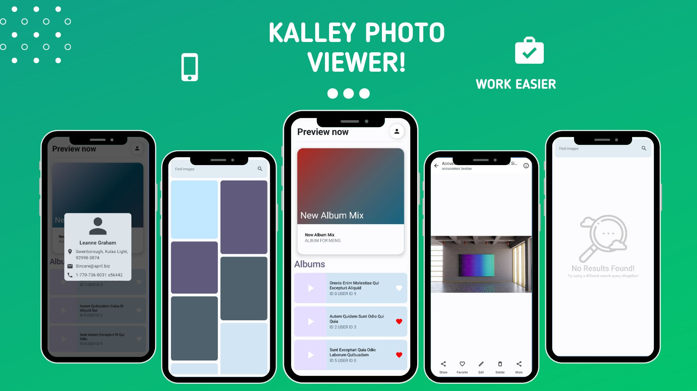

# Kallery

# Knounce
A miniature two-screened gallery app. Even with such a scale, it's jam-packed with various technologies
favored and maintained by Google for Android development .

# Technologies
- [Kotlin]()
- [MVVM]()
- [Android JetPack]()
- [Jetpack compose]()
- [Retrofit 2]()
- [Dagger Hilt]()
- [Coroutines]()
- [Flow]()
- [Android Unit testing]()

## Screenshots

     &nbsp; 

## Install
Git clone the project and build it on a local machine, then launch it on a physical device or an emulator.

## Contributing
Pull requests are welcome. For major changes, please open an issue first
to discuss what you would like to change.

## Comparison with translation apps

## License
[MIT](./LICENSE)